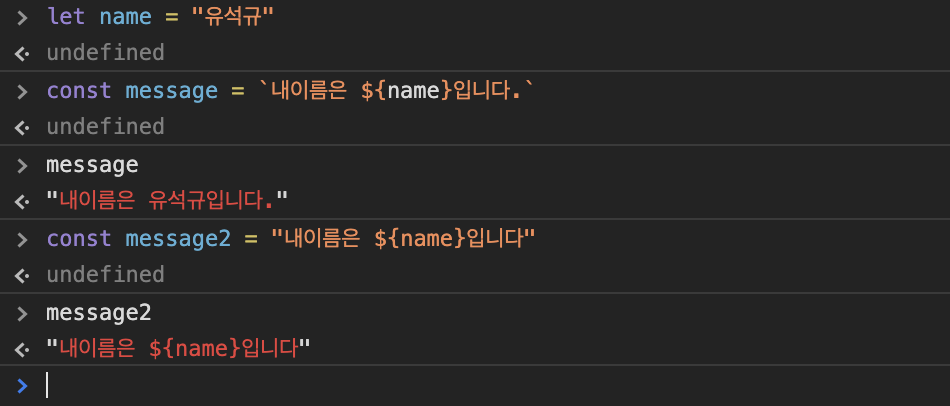

# 3장. 리터럴과 변수, 상수, 데이터 삽입
## 3.1 변수와 상수
- 변수 : 이름이 붙은 값, 변할수 있는 가변 값
- let 은 변수 선언에만 쓰이고 그 이후에는 currentTempC = 44; 등으로 바꿀 수 있다
- 각 변수는 한 번만 선언 할 수 있다.
```javascript
let currentTempC = 22; 
```
- 변수를 선언할때 꼭 초기값을 지정해야 하는건 아님
```javascript
let targetTempC //let targetTempC = undefined;와 같음
```
- let문 하나에서 변수 여러 개를 선언할 수 있다.
```javascript
let targetTempC, room1 = "conference_room_a", room2 = "lobby";
//targetTempC는 값을 할당하지 않으므로 undefined
//room1은 conference_room_a
//room2는 lobby
```
- 상수(constant)는 ES6에서 새로 생겼습니다. 
- 상수도 변수와 마찬가지로 값을 할당받을 수 있지만 한번 할당한 값은 바꿀 수 없습니다.
- 상수 역시 여러 개를 선언할 수 있습니다.
- 절대적인 규칙은 아니지만, 상수 이름에는 보통 대문자와 밑줄만 사용합니다.
```javascript
const ROOM_TEMP_C = 21.5, MAX_TEMP_C = 30;
```
## 3.2 변수와 상수 중 어떤 것을 써야 할까요?
- 될 수 있으면 변수보다 상수를 써야합니다.
- 가변 값보다 고정 값이 제어하기 쉽고 에러를 방지합니다.

## 3.3 식별자 이름
> ### 식별자 규칙
> - 식별자는 반드시 글자나 달러 기호($), 밑줄(_)로 시작해야 합니다.
> - 식별자에는 글자와 숫자, 달러 기호, 밑줄만 쓸수 있습니다.
> - 유니코드 문자도 쓸수 있습니다.
> - 예약어는 식별자로 쓸 수 없습니다. 
> - 식별자는 대문자로 시작해서는 안됩니다.
> - 밑줄이 한 개 또는 두 개로 시작하는 식별자는 아주 특별한 상황, 또는 '내부'변수에서만 사용합니다. 
> - 제이쿼리를 사용할 경우 달러($) 기호로 시작하는 식별자는 보통 제이쿼리 객체라는 의미입니다.

> ### 식별자 표기법
> - 카멜케이스 : camelCase
> - 스테이크 케이스 : snake_case

## 3.4 리터럴
```javascript
let room1 = "conference_room_a"; // 식별자 = "리터럴";
```

## 3.5 원시 타입과 객체
### 원시타입
`
문자열과 숫자같은 원시타입은 불변입니다.
다만 불변성이라는 말이 변수의 값이 바뀔수 없다는 뜻은 아닙니다.
`
- 숫자
- 문자열
- 불리언(Boolean)
- null
- undefined
- 심볼(Symbol)

```javascript
let str = "hello";
str = "world";
```
### 객체

`
객체는 원시 값과 달리 객체는 여러가지 형태와 값을 가질 수 있습니다.
`
- Array
- Date
- RegExp
- Map과 WeakMap
- Set과 WeakSet
- 원시 타입 중 숫자, 문자열, 불리언에는 각각 대응하는 객체 타입인 Number/String/Boolean이 있습니다.
- 이들 객체는 실제 값이 저장되지 않는다. 이들은 대응하는 원시 값에 기능을 제공하는 역할을 한다.

## 3.6 숫자

## 3.7 문자열
문자열은 텍스트 데이터 입니다. 자바스크립트 문자열은 유니코드(Unicode) 텍스트 입니다.  
자바스크립트 문자열 리터럴에는 작은따옴표(''), 큰따옴포(""), 백틱(``)을 사용합니다.  
백틱은 ES6에서 도입한 것이며 템플릿 문자열에서 사용합니다.

### 3.7.1 이스케이프
따옴표 안에 따옴표 사용시 에러가 생깁니다. 이때 역슬래시(`\`)를 써서 따옴표를 **이스케이프** 하면 문자열이 여기서 끝나지 않았다고 자바스크립트에 알릴 수 있습니다.
```javascript
const dialog = "He looked up and said \"Don't do that!\" to Max.";
```

## 3.8 특수문자
역슬래시는 따옴표를 이스케이프할 때만 쓰지 않습니다. 줄바꿈 문자처럼 화면에 표시되지 않는 일부 특수문자나 임의의 유니코드 문자를 나타낼 때도 역슬래시를 사용합니다.

널리쓰이는 특수문자

| 코드 | 설명 | 예제 |
|---|---|---|
| \n | 줄바꿈 문자 | "Line1\nLine2" |
| \r | 캐리지 리턴 | "Windows line 1\r\nWindows line2" |
| \t | 탭 | "Speed:/t60kph" |
| \\' | 이스케이프 | "Don\\`'t" |
| \\" | 이스케이프 | 'Sam said \\"hello\\".'|
| \\\` | 백틱 | \`New in ES6: \\\` string` |
| \\$ | 달러기호 | \`New in ES6: ${interpolation}\`|
| \\\ | 역슬래시 | "Use \\\\\\\\ to represent \\\\!"|
| \uXXXX | 임의의 유니코드 포인트. 여기서 XXXX는 16진수 코드 포인트 입니다.| "Do Morgan's law: \u2310(P \\u22c0Q)"|

### 3.8.1 템플릿 문자열
템플릿 문자열은 문자열의 정해진 위치에 값을 채워 넣는 간단한 방법입니다. 문자열 템플릿에는 **큰 따옴표나 작은 따옴표를 쓰지않고 백틱(`)을 사용합니다.**

